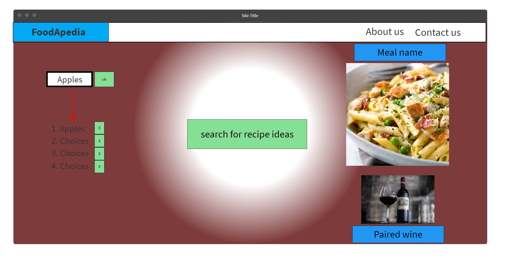

# Project 1: FOODAPEDIA

<h2 style= "color: green; font-weight: bold;">
  Project Proposal
</h2>

Using server APIs from Recipe - Food - Nutrition, we will be building an application that will provide recipes/ideas based on the list of ingridients that he user provide. Once you get the recepi of your choice, foodapedia will suggest the wine to pair with your meal... ENJOY!! 

 

## :heavy_check_mark: User Story

* As a user, I can enter a set of ingredients that they want to work with and the application will provide suggestions of meals or recipes.

* As a user, when they click on the recipe/meal it will prompt you to a picture of it and the application will suggest wines to pair with your meal.

* For future realeases, the applicaiton will provide, dietary options, location of the nearest grocey/liquor stores. 

 

## :heavy_check_mark: Wireframe

This is the rough proposed layout of our web app:

 

## :heavy_check_mark: APIs to be used

The proposed APIs that we will be using (subject to change ) will be from https://spoonacular.com/. 

The initial APIs that will be feeding our application will be:

* https://spoonacular.com/food-api/docs#Search-Recipes-by-Ingredients
* https://spoonacular.com/food-api/docs#Get-Recipe-Information
* https://spoonacular.com/food-api/docs#Get-Similar-Recipes
 

## :heavy_check_mark: Rough breakdown of tasks

We haven't finalized our taks breakdown but we are planning on doing it by features if possible:

Tasks | #1 | #2 | #3 | #4
--- | ---- | --- | --- | --- 
HTML  | build base HTML | add frameworks to be used | replicate wireframe | use Foundation framework for styling
JS | build global variables | build functions to call APIs  | build objects to be used from API in our app
CSS | build base CSS |  add reset CSS | 