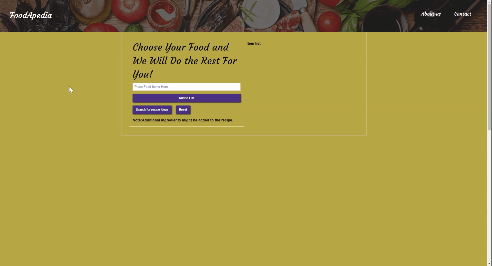
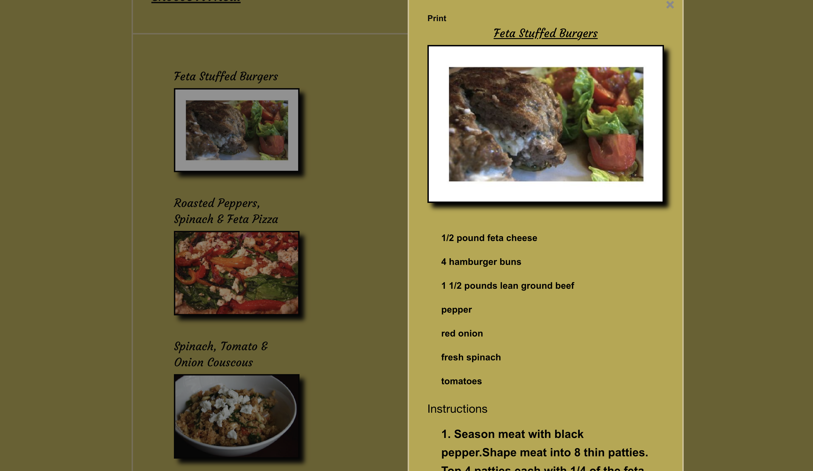
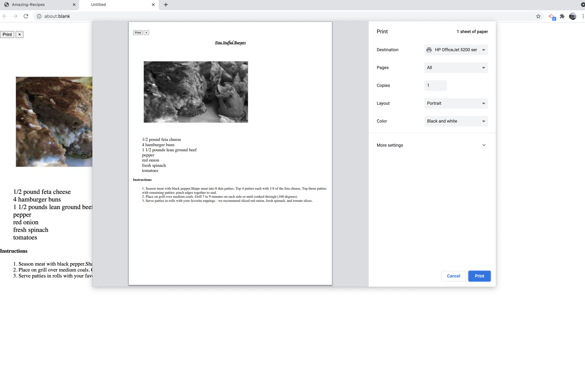

# Project 1: FoodApedia

For the love of food, three individuals - Santiago, Savannah, and Fatimah - have come together to develop an application that will revolutionize the way you eat. This application is built around the excess ingredients that you already have hanging around in your kitchen, but you have no idea what to make from them. This application will create a meal based on the 5, or less,  ingredients that you input in the selection process. Turn your daily items into an enjoyable meal and save your pockets from buying takeout!

## Application Requirements Met...

* Use a CSS framework other than Bootstrap.

* Be deployed to GitHub Pages.

* Be interactive (i.e., accept and respond to user input).

* Use at least two server-side APIs.

* Does not use alerts, confirms, or prompts (use modals).

* Use client-side storage to store persistent data.
* Be responsive.

* Have a polished UI.

* Have a clean repository that meets quality coding standards (file structure, naming conventions, follows best practices for class/id naming conventions, indentation, quality comments, etc.).

* Have a quality README (with unique name, description, technologies used, screenshot, and link to deployed application).

## FoodApedia Presentation

Here is our link to our launched site: [FoodApedia](https://santipalacios2002.github.io/foodApedia/)

Here is our link to our original proposal: [FoodApedia Proposal](/proposal.md)

### Homepage
#

When the user first enters our application, they will see a well polished and inviting site. There is an about us and contact portion for the user to access as well. The user will then click 'Let's Begin' to proceed to the rest of the site. 

### Ingredients List & Meal Search
#

Users will then have the opportunity to add up to five ingredients. These ingredients will be displayed on screen. Users have the opportunity to delete ingredients if needed before pressing the "Search for Recipe Ideas" button. Once this button is pressed, it will populate four meal possibilities to make based on the ingredients listed. 

You will also see that there are some safeguard modals enabled to help guide users during application usage. 

### Recipe Display
#

Users can then click on a recipe of their choice, and the recipe modal will diplay all ingredients and a step by step process to make the meal of their choice. Users may also use the print function to print the recipe for keepsake later. 

  

  

### Lessons Learned
#
* Foundations framework

* API practice

* Modals

* Working as a team within GitHub
